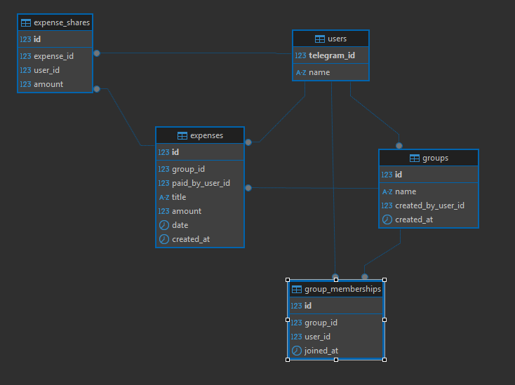

# @Tr1Count_bot - Telegram Bot
Copy the project:
```bash
    git clone https://github.com/twoj-username/BotTricaunt.git
    cd BotTricaunt
```
Set up .env file accordingly with .env.example.

```
TELEGRAM_BOT_TOKEN= (Can be generated with @BotFather in Telegram)

SPRING_DATASOURCE_USERNAME= 
SPRING_DATASOURCE_PASSWORD=

POSTGRES_DB=
POSTGRES_USER=
POSTGRES_PASSWORD=
```

Start with 
```bash
    docker compose up --build
```

Database diagram:

